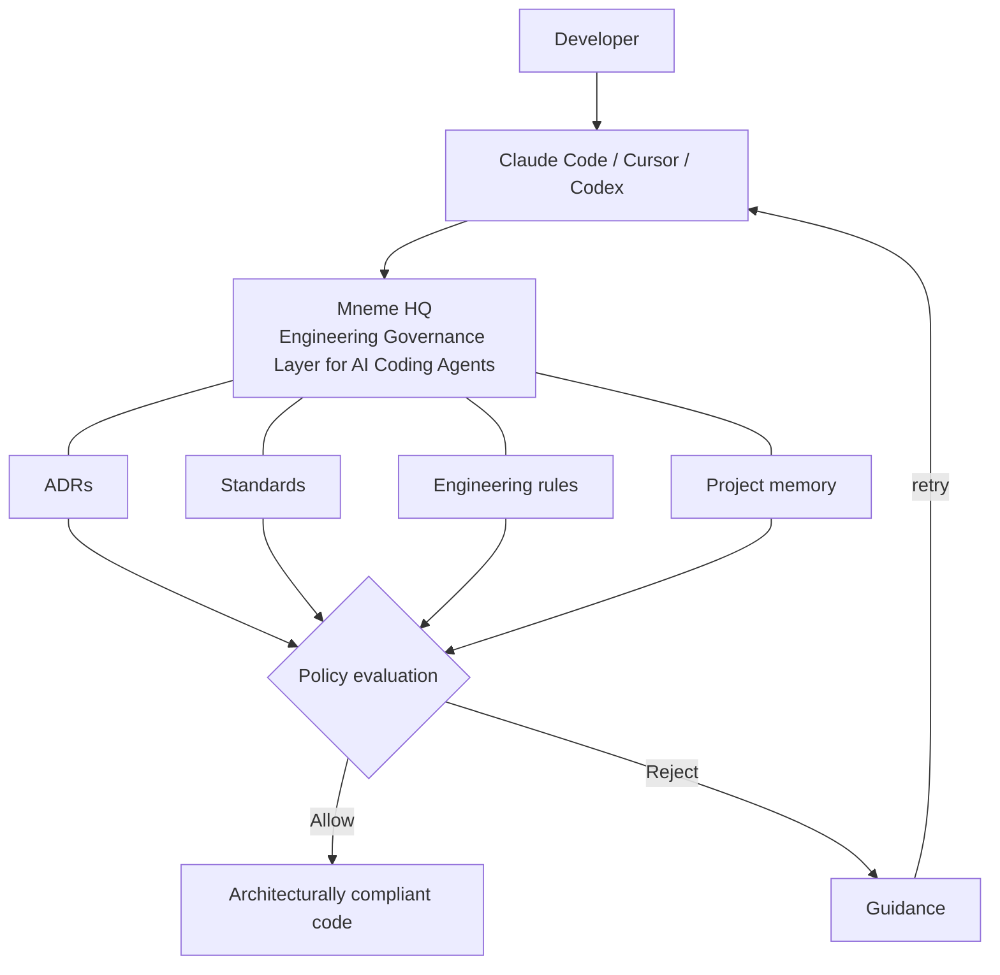
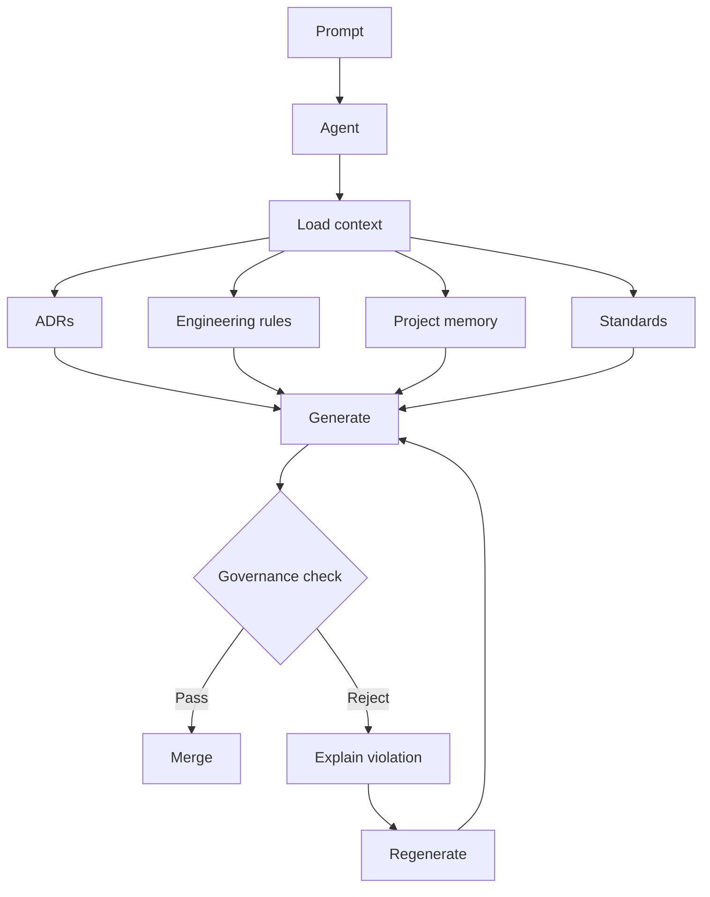
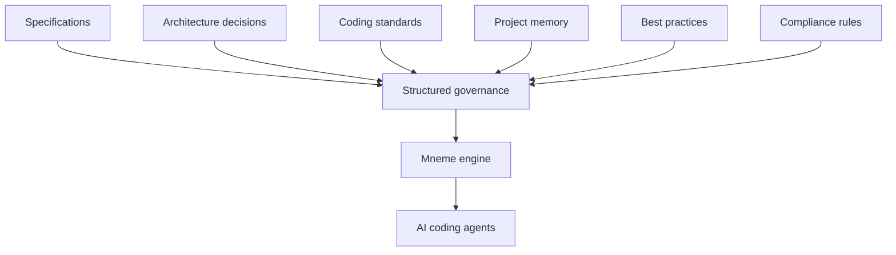
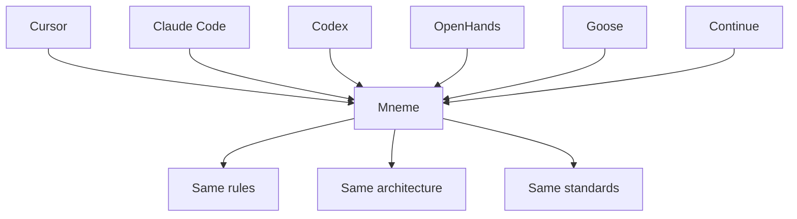
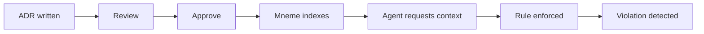
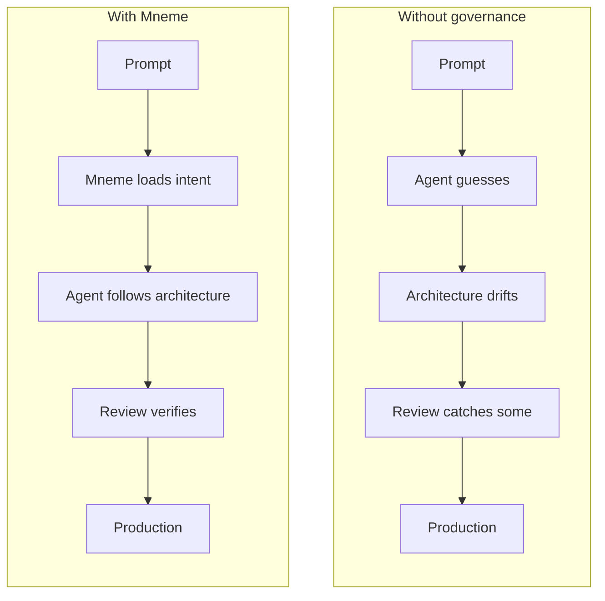
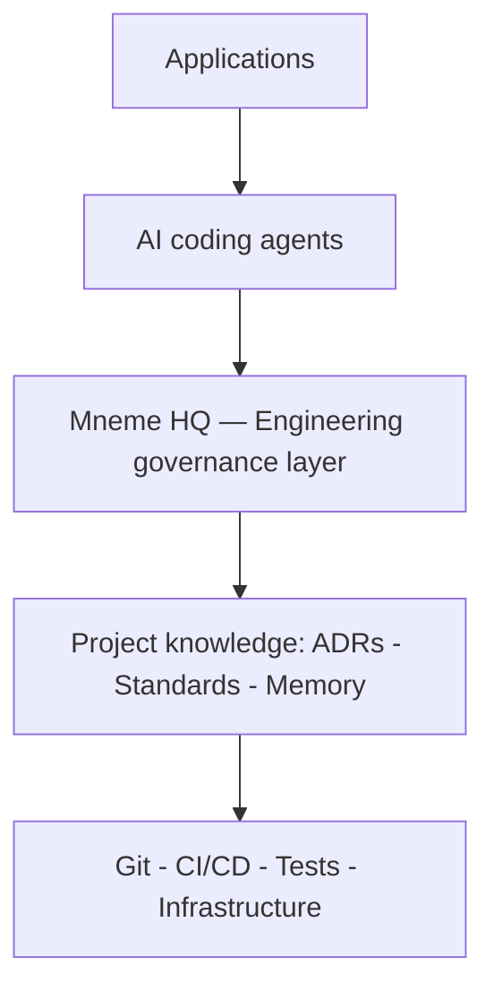

# Mneme HQ architecture diagrams

Mermaid sources for the Mneme HQ architecture set. GitHub renders these inline,
they version with the code, and they export to SVG for the site, decks, and
analyst briefings. The on-site (mnemehq.com) versions are hand-authored inline
SVG using the brand `.diag-*` primitives; these Mermaid sources are the
developer-facing, diff-able source of truth for the same diagrams.

## 1. Where Mneme sits

The single most important diagram: where the engineering governance layer fits
between coding agents and generated code.

## 2. Generation flow

What happens at runtime when an agent generates code under governance.

## 3. Engineering governance model

How heterogeneous sources of engineering intent unify into governance the
engine can enforce.

## 4. Multi-agent governance

One set of rules, applied identically across every agent a team uses.

## 5. Decision lifecycle

From an architectural decision to enforcement against agent-generated change.

## 6. With vs without Mneme

The comparison that lands fastest in a sales or analyst conversation.

## 7. Position in the AI engineering stack

Where engineering governance sits as a layer, alongside CI/CD, testing, and
code review rather than replacing them.

---

**Maintenance:** keep these in sync with the on-site SVG versions. When a
diagram changes, update the Mermaid source here first (it is the diff-able
source of truth), then regenerate or hand-edit the brand SVG on the site.
