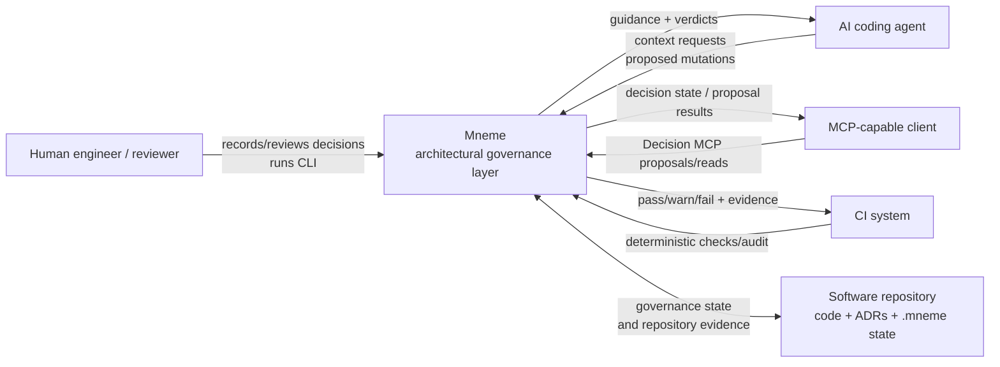
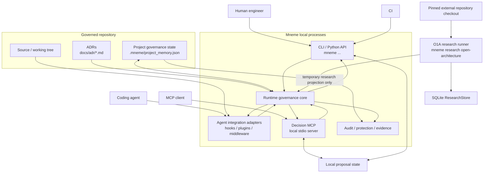
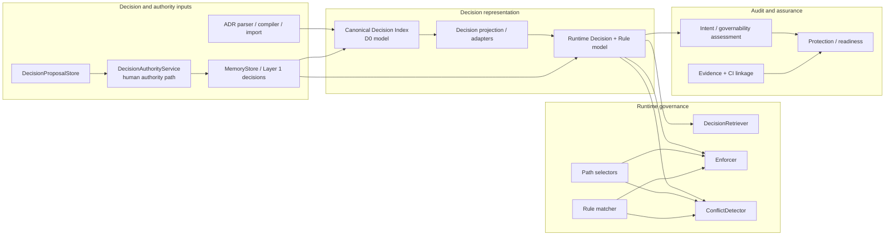

# Mneme Architecture

> Repository-native architecture orientation for contributors and agents.
>
> Start here for the structural map. Follow the linked ADRs for the decisions
> that govern the structure and behavior. Code and ADR status remain
> authoritative if this overview ever lags.

## How to read this bundle

This document combines three views that answer different questions:

1. **ASCII architecture map** — the fastest operational view of the repository.
2. **C4 views** — system context, runtime containers, and core components.
3. **ADR map** — the architectural decisions that explain why the system has
   these boundaries and which parts are accepted versus still proposed.

This is an orientation document, not a second source of architectural truth.
It deliberately links to ADRs rather than restating their full contracts.

## Current architecture at a glance

```text
 Human engineer / reviewer        AI coding agent         MCP client        CI
            |                           |                    |              |
            |                           |                    |              |
            +-------------+-------------+--------------------+--------------+
                          |
                          v
                +-----------------------+
                |  Mneme entry surfaces |
                |-----------------------|
                | CLI / Python API      |
                | agent hooks/adapters  |
                | Decision MCP          |
                +-----------+-----------+
                            |
                            v
        +---------------------------------------------------+
        |                 Mneme core                        |
        |---------------------------------------------------|
        | Decision / authority inputs                       |
        |   ADR parser + compiler                           |
        |   proposal store + human acceptance path          |
        |                                                   |
        | Decision representation                           |
        |   Layer 1 Decision runtime model                  |
        |   D0 canonical Decision Index model               |
        |   projection/adapters                             |
        |                                                   |
        | Runtime governance                                |
        |   DecisionRetriever       -> relevant guidance    |
        |   Enforcer                -> deterministic verdict|
        |   ConflictDetector        -> response conflicts   |
        |   path selectors / rule matcher                   |
        |                                                   |
        | Audit + evidence                                  |
        |   governability / readiness / protection          |
        |   declared + CI evidence                          |
        +----------------------+----------------------------+
                               |
               +---------------+----------------+
               |                                |
               v                                v
   +-------------------------+       +----------------------+
   | Repository governance   |       | Repository mutation  |
   |-------------------------|       | / validation surfaces|
   | docs/adr/*.md           |       |----------------------|
   | .mneme/project_memory.json |       | working tree         |
   | source provenance       |       | hooks / stop audit   |
   +-------------------------+       | CI gate              |
                                     +----------------------+

 Separate research boundary (O1A):

 pinned external repository
          |
          v
 discovery -> candidate extraction -> semantic classification
          -> temporary Decision projection -> frozen DecisionRetriever
          -> Governing Decision Set metrics -> SQLite ResearchStore

 The research path does NOT write to canonical Mneme authority, MemoryStore,
 DecisionIndex, or DecisionProposal state.
```

## Important current-versus-target boundary

The current code and ADR corpus intentionally contain both shipped architecture
and future architecture contracts.

- [ADR-023](../adr/ADR-023-canonical-decision-index-and-runtime-projection-boundary.md)
  is **accepted**. It establishes the canonical Decision Index abstraction and
  the Layer 1 runtime projection boundary.
- The current `mneme/decision_index.py` implementation is the validated D0
  canonical model. It remains an in-memory canonical view with the compatibility
  constraints described by ADR-023.
- [ADR-027](../adr/ADR-027-decision-mcp-proposal-ingestion-and-authority-boundary.md)
  is **accepted**. The Decision MCP may propose and read decision state, but it
  does not receive authority to accept, reject, activate, supersede, bypass, or
  create trusted evidence.
- [ADR-030](../adr/ADR-030-canonical-decision-persistence-version-identity-and-stable-rule-lineage.md)
  is currently **proposed**, not accepted. Its durable `decision_index`
  persistence, version-occurrence identity, and stable rule-lineage model must
  therefore be treated as a target architecture, not as completed runtime
  behavior.
- [ADR-025](../adr/ADR-025-trusted-test-execution-attestation.md) is also
  **proposed**. Trusted test-execution attestation remains reserved/deferred.

Do not collapse these states in documentation or implementation. A proposed ADR
can explain intended direction, but it is not a governing contract until its
status changes.

# C4 Level 1 — System Context

The context view shows Mneme as a local governance system around software
development workflows.



### Context boundary

Mneme is not the coding agent, source-control host, CI platform, or deployment
observability system. It consumes repository-local architectural intent and
applies deterministic governance at the reliable boundaries exposed by those
systems.

# C4 Level 2 — Containers

These are logical runtime/deployment containers, not Python package boundaries.



### Container invariants

- Agent-specific adapters translate native events into the same Mneme
  governance semantics; integrations do not become independent policy
  authorities.
- Retrieval and enforcement are separate concerns.
- Decision MCP proposal ingestion does not grant producer authority.
- Audit evidence does not silently become trusted enforcement evidence.
- O1A research state is isolated from canonical product authority.

# C4 Level 3 — Core Components

This view zooms into the logical Mneme core used by the CLI, integrations,
Decision MCP, Audit, and research evaluation.



The arrows describe responsibility and data flow at an architectural level.
They do not imply that every component is already backed by one durable
canonical persistence path. In particular, ADR-030 remains proposed.

# Research boundary — O1A Open Architecture

The O1A research harness is intentionally represented separately because it
uses parts of the Mneme runtime without gaining product authority.

```mermaid
flowchart LR
    Repo["Pinned external repo"]
    Discover["Deterministic source discovery"]
    Extract["Candidate extraction"]
    Classify["Explicit semantic classification"]
    Normalize["Fail-closed vocabulary normalization"]
    Candidate["Research DecisionCandidate"]
    Project["Temporary in-memory Decision projection"]
    Retrieve["Frozen DecisionRetriever"]
    GDS["Governing Decision Set evaluation"]
    Store["SQLite ResearchStore"]
    Export["Research reports / exports"]

    Repo --> Discover --> Extract --> Classify --> Normalize --> Candidate
    Candidate --> Project --> Retrieve --> GDS --> Store --> Export
```



**Hard boundary:** research execution does not promote candidates into
`MemoryStore`, the canonical Decision Index, or DecisionProposal authority.
Promotion, if ever introduced, requires an explicit architecture decision.

# ADR map

The full ADR corpus is in [`docs/adr/`](../adr/). The table below is the
minimum reading set for understanding the current runtime architecture.

| ADR | Status | Architectural question it answers |
| --- | --- | --- |
| [ADR-017](../adr/ADR-017-enforcement-scope-vs-retrieval-scope.md) | Accepted | Why enforcement scope is independent of retrieval ranking. |
| [ADR-018](../adr/ADR-018-introduced-delta-enforcement-at-the-edit-gate.md) | Accepted | Which part of an edit is evaluated at the edit gate. |
| [ADR-019](../adr/ADR-019-typed-literal-rule-contract.md) | Accepted | What the deterministic `FORBID_LITERAL` rule means. |
| [ADR-020](../adr/ADR-020-explicit-path-applicability-for-typed-rules.md) | Accepted | How typed-rule path applicability is represented and evaluated. |
| [ADR-021](../adr/ADR-021-shell-preflight-and-stop-session-delta.md) | Accepted | How prevent/catch/verify coverage handles shell and stop boundaries. |
| [ADR-022](../adr/ADR-022-main-is-pr-and-squash-only.md) | Accepted | Repository authority: PR-only, squash-only changes to `main`. |
| [ADR-023](../adr/ADR-023-canonical-decision-index-and-runtime-projection-boundary.md) | Accepted | Canonical Decision Index versus Layer 1 runtime projection. |
| [ADR-024](../adr/ADR-024-declared-test-evidence-ingestion.md) | Accepted | How declared test evidence may be ingested without executing untrusted repository code. |
| [ADR-025](../adr/ADR-025-trusted-test-execution-attestation.md) | Proposed | Future trusted test-execution attestation boundary. |
| [ADR-026](../adr/ADR-026-audit-tier-semantics-and-mneme-potential.md) | Accepted | Meaning of Protected, Mneme-ready, Requires modelling, and Guidance. |
| [ADR-027](../adr/ADR-027-decision-mcp-proposal-ingestion-and-authority-boundary.md) | Accepted | Why MCP producers can propose/read but cannot exercise decision authority. |
| [ADR-028](../adr/ADR-028-public-decision-intent-assessment.md) | Accepted | Public API semantics for classifying decision intent. |
| [ADR-029](../adr/ADR-029-enforcement-evidence-binding-semantics.md) | Accepted | How enforcement evidence binds to governed decisions without requiring runtime observation. |
| [ADR-030](../adr/ADR-030-canonical-decision-persistence-version-identity-and-stable-rule-lineage.md) | Proposed | Target persistence, version identity, and stable rule lineage for the canonical index. |

## Suggested reading paths

**To understand enforcement:** ADR-017 -> ADR-018 -> ADR-019 -> ADR-020 -> ADR-021.

**To understand the Decision Index and MCP:** ADR-023 -> ADR-027 -> ADR-029,
then read proposed ADR-030 as target architecture.

**To understand Audit evidence:** ADR-024 -> ADR-026 -> ADR-028 -> ADR-029.
Read proposed ADR-025 only for the deferred trusted-attestation direction.

# Source-to-enforcement trace

A useful mental model for the product is:

```text
human architectural intent
        |
        v
ADR / structured decision source
        |
        v
validated decision representation
        |
        +------------------+
        |                  |
        v                  v
relevant context      typed enforceable rule
(retrieval)           + applicability
        |                  |
        v                  v
coding agent          deterministic evaluation
        |                  |
        +--------+---------+
                 |
                 v
          allow / warn / fail
                 |
                 v
        evidence + audit state
```

The key architectural rule is that **retrieval relevance does not decide
enforcement authority**. A decision may be useful context without being
mechanically enforceable, and a typed enforceable rule must not disappear
merely because retrieval ranking is low.

# Maintenance rules

Architecture documentation is governed by
[`documentation-governance.md`](./documentation-governance.md). Every PR
classifies architecture impact, and architecture-affecting changes update the
relevant views in the same PR.

When changing this document:

1. Check the implementation and the governing accepted ADRs together.
2. Check ADR frontmatter status; do not describe `proposed` as governing.
3. Do not copy detailed ADR contracts into this overview. Link to them.
4. Keep the O1A research boundary visibly separate from canonical product
   authority.
5. Update the C4 views when a responsibility or authority boundary changes,
   not for every new module or helper function.
6. If implementation and an accepted ADR disagree, surface the discrepancy;
   do not silently choose one representation or hide the drift.
7. Keep current and target architecture visibly distinct.

## Related architecture documentation

- [Architecture documentation governance](./documentation-governance.md)
- [Mneme Architecture Documentation Standard v1](./architecture-documentation-standard-v1.md)
- [Current phase](./current-phase.md)
- [Governance representation](./governance-representation.md)
- [Layer 1 freeze](./layer1-freeze-e73ff7d.md)
- [Supplementary architecture diagrams](../architecture-diagrams.md)
- [Integration support matrix](../integrations/README.md)
- [Full ADR corpus](../adr/)
